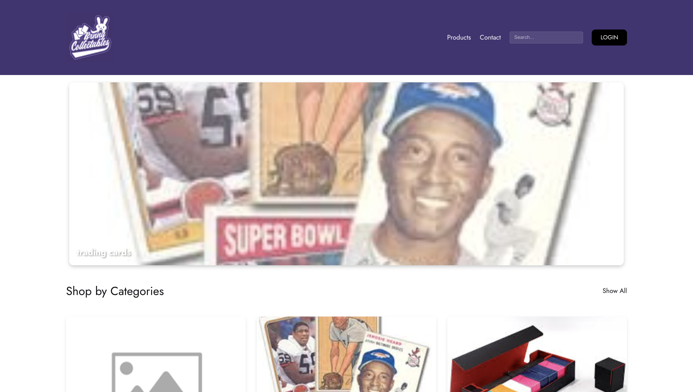

# BunnyPayload - E-commerce Platform

[](assets/images/bunnypayloadScreenshot.png)

A modern, full-featured e-commerce platform built with Payload CMS, Next.js, and MongoDB. This project delivers a seamless shopping experience while providing administrators with powerful content management capabilities.

## 🚀 Features

### Dynamic Item Management
- Create, edit, and manage product listings through Payload CMS
- Advanced product filtering and search functionality
- Support for product categories, subcategories, and variations (size, color)

### User Authentication
- Secure user registration and login system
- Dynamic navigation based on authentication status
- Profile management for customers

### Payment Integration
- Stripe integration for secure payment processing
- Card saving functionality
- Order history tracking
- Automated email confirmations

### SEO & Performance
- Built-in SEO optimization tools
- Custom redirect handling
- Category-based navigation system
- Responsive design for all devices

### Content Management
- CMS-driven content flexibility
- Banner and promotion management
- Nested document support
- Cloud-based hosting with payloadCloud() plugin

## 🛠️ Tech Stack

- **Frontend**: Next.js
- **Backend**: Payload CMS
- **Database**: MongoDB
- **Payment**: Stripe
- **Storage**: AWS S3
- **Authentication**: JWT

## 🚀 Getting Started

### Prerequisites
- Node.js
- MongoDB Atlas account
- AWS S3 bucket
- Stripe account

### Installation

1. Clone the repository
2. Copy `.env.example` to `.env` and configure the following variables:
   ```
   DATABASE_URI=your_mongodb_atlas_uri
   PAYLOAD_SECRET=your_jwt_secret
   S3_BUCKET= bucket_name
   S3_ACCESS_KEY_ID= secret_key_id
   S3_SECRET_ACCESS_KEY= access_key
   S3_REGION= region
   ```

3. Install dependencies:
   ```bash
   npm install
   ```

4. Build the project:
   ```bash
   npm run build
   ```

5. Start the development server:
   ```bash
   npm run dev
   ```

6. Access the Payload admin panel and register for the admin role

## 📝 License

This project is licensed under the MIT License - see the LICENSE file for details.

## 🤝 Contributing

Contributions, issues, and feature requests are welcome! Feel free to check the issues page.